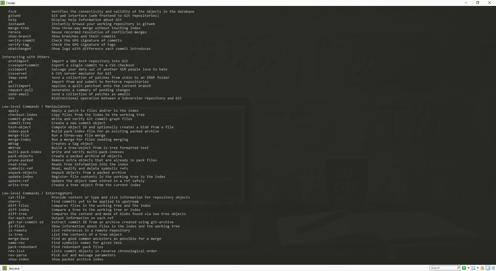

### Lists
    Unordered Lists
* Item 1
* Item 2
    * Item a
    * Item b

###
    Ordered Lists
1. Item 1
2. Item 2
    * Item 2.a
    * Item 2.b

### Images


### Emphasis
*ITALIC FONT* <BR>
_ITALIC FONT ALSO_ <BR>
**BOLD FONT** <BR>
__BOLD FONT ALSO__ <BR>
*YOU CAN **COMBINE** THEM* <br>
<s>Deleted Words</s>

### Links
[Github](http://github.com) <br>
<https://github.com>

### Ref Links
You can also put the [google](http://google.com) in combination method.

### Block Quotes
As Grace Hopper said:
> I've always been more interested <br>
> in the future than in the past. <br>

### Fenced Code Blocks
```javascript
function mark_down() {
    console.log('Hello MarkDown Language');
}
```

```c#
for(int i=0;i<5;i++){
    Console.WriteLine("Hello MarkDown Language");
}
```

```stacktrace
java.lang.NullPointerException
        at com.ClassA.someMethod(ClassA.java:20)
        at com.ClassA.someMethod2(ClassA.java:10)

```

### Tasks Lists
- [x] this is a complete item
- [ ] this is an incomplete item, [links]()
- [x] @mentions, and <del>tags</del> supported
- [x] list syntax require (any unordered or ordered list)

### Tables
First Header | Second Header
------------ | -------------
Content cell 1 | Content Cell 2
Content col 1 | Content col 2

### Embedded Videos

[](./video/test.mp4 "Video Test")

### Black Box <using tab>
    Hi Black box style

### Black Box <using ``>
`Hi Black Box`

### Horizontal Rule

---

### Badge
<p align="center">
<a href="https://github.com/iamkun/dayjs/blob/master/LICENSE">
</a>
</p>

<p align="center">
<a href="https://github.com/iamkun/dayjs/blob/master/LICENSE">
</a>
</p>

    To Create any badge url src:
    write : https://img.shields.io/badge/
    then : (first word)-(highlight word)-(color).svg?style=flat"